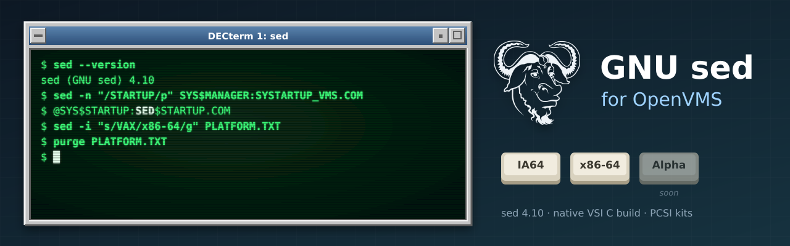

<p align="center">
  
</p>

# GNU sed for OpenVMS

A port of current GNU sed to OpenVMS on **IA64** and **x86-64**, kept as a thin layer over
the official GNU release so that it can follow upstream releases with minimal effort. This
port starts from **GNU sed 4.10**. It is built with exactly the same methods as
[GNU grep for OpenVMS](https://github.com/issinoho/vms-grep), and its tools are copies of
grep's.

This repository holds **only our changes**. Upstream source is never stored here: every
build starts from the signed release tarball, applies our patches, adds our VMS-only
files, and generates the configuration for VSI C.

## Status

Work in progress: sed builds and passes its smoke test on both architectures; the upstream
test suite runs under GNV; a PCSI kit follows.

| | IA64 (OpenVMS V8.4-2L3, VSI C 7.4) | x86-64 (OpenVMS E9.2-4, VSI C 7.7) |
|---|---|---|
| Builds with MMS | yes | yes |
| DCL smoke test | 25/25 | 25/25 |
| Upstream test suite (75 tests) | not runnable (GNV too old) | in progress |
| PCSI kit | planned | planned |

See [docs/TESTING.md](docs/TESTING.md) for every skipped and expected-to-fail test.

## Using sed on OpenVMS

- **Defining the command:** `$ sed :== $dev:[dir]SED.EXE`, or put the directory in
  `DCL$PATH`.
- **Quote the script.** Under the default `PARSE_STYLE=TRADITIONAL`, DCL upper-cases
  unquoted arguments and the C runtime then lower-cases them, so quote sed scripts and
  upper-case options: `sed "s/Foo/Bar/" file.txt`, `sed "-E" "s/(a|b)/x/" file.txt`. With
  `$ SET PROCESS/PARSE_STYLE=EXTENDED` the case of unquoted arguments is kept as well.
- **In-place editing (`-i`)** follows VMS custom: `sed -i "s/a/b/" file.txt` writes a new
  version of the file and leaves the original as the previous version (`PURGE` removes
  it). `-i.bak` instead renames the original to `file.txt.bak` (`file^.txt.bak` on an
  ODS-5 disk) and writes the edited file under the original name. The rewritten file is
  Stream_LF, whatever the record format of the original.
- **Exit status:** sed returns POSIX exit codes (0 success, 1 invalid command, 2 missing
  input file, 4 I/O error, or the code given to `q`/`Q`), encoded in `$STATUS` as
  C-facility values. In DCL, `($STATUS .AND. %X7F8) / 8` gives the code.
- **File names** are reported in Unix form (`dir/file.txt`).
- **Locales:** set one with a logical name or an environment variable, for example
  `$ DEFINE LC_ALL "UTF8-20"`. VMS has no `en_US.UTF-8`; use the generic `UTF8-xx`
  locales. IA64 ships only `UTF8-20` (at most 3-byte characters).
- **Overriding the C runtime switches:** sed sets several at start-up (Unix file names,
  case preservation, …; see `overlay/vms/vms_crtl_init.c`). Defining the corresponding
  `DECC$` logical name yourself overrides sed's choice.

## Repository layout

```
upstream.conf          upstream version, tarball URL, SHA-256, signing key
patches/               unified diffs against the upstream tree, applied in order (series)
overlay/               new files only, copied into the tree (never replaces upstream files)
  vms/                 DESCRIP.MMS, BUILD.COM, VMS C sources, test procedures
  vms/config/          configure answers for VSI C (generated + hand-settled), compiler flags
tools/                 host-side scripts: fetch, prepare, push, configure, build, test
snapshot/              resolved config.h, source lists, every configure answer (reviewed)
docs/                  testing
cache/ staging/ out/   generated locally, not committed
```

## Patches

| Patch | Purpose |
|---|---|
| 0001 | `assert.h`: redefine `assert` on each inclusion. The CRTL header is include-guarded. (From vms-grep.) |
| 0002 | `getprogname`: VMS implementation using `JPI$_IMAGNAME`. (From vms-grep.) |
| 0003 | sed: also take `LC_ALL`/`LC_*`/`LANG` from environment variables (the CRTL reads only logical names). |
| 0004 | sed: write output with `putc` on VMS. For record-oriented stdout (terminal, log file, mailbox) the CRTL turns each `fwrite` item into a record, so lines came out one character per line. |
| 0005 | lib: include the generated `*.gl.h` headers as `*_gl.h`. VSI C cannot include a file name with two dots; `prepare.sh` renames them. |
| 0006 | `scratch_buffer`: `__align` is a keyword in VSI C; rename the member. |
| 0007 | sed: name the program "sed" in messages and `--version`, not the full image path. |
| 0008 | tests: `test-mbrtowc` takes the locale from the environment. |
| 0009 | tests: `CuTmpdir.pm` on VSI Perl (VMS directory template; `$? = 0` in an END block exits 1). |
| 0010 | tests: `Coreutils.pm` runs each test command with GNV bash rather than DCL, exporting `PATH` and the locale. |

Patches 0008–0010 change only the test suite.

## How to build

The build has two halves. A **Linux host** prepares a ready-to-compile source tree from
the GNU release, and an **OpenVMS system** compiles it with VSI C and MMS. The scripts in
`tools/` can drive the VMS side over ssh. The prepared tree is self-contained, though, so
you can also copy it to VMS any way you like and build there by hand.

### What you need

- **Linux host:** git, bash, python3, gcc and make (for the host-side `configure` run),
  curl and gpg. ssh/sftp too, if you want the automated route.
- **OpenVMS IA64 or x86-64:** VSI C and MMS. OpenSSH for the automated route. GNV (bash
  4.4 and coreutils, x86-64) and VSI Perl for the upstream test suite. Tested on IA64
  V8.4-2L3 with VSI C 7.4, and on x86-64 E9.2-4 with VSI C 7.7.

### 1. Prepare the source tree (Linux)

```sh
git clone https://github.com/issinoho/vms-sed.git
cd vms-sed
tools/prepare.sh
```

This downloads the sed release named in `upstream.conf`, and checks its SHA-256 and GPG
signature against the GNU keyring. It then applies `patches/`, adds `overlay/`, generates
`config.h`, the gnulib headers and the MMS source list from the committed VMS configure
answers, and leaves the result in `staging/sed-4.10/`.

### 2a. Build on VMS by hand

Copy these parts of `staging/sed-4.10/` to a directory on the VMS system, keeping the
directory structure: `config.h`, `basicdefs.h`, `lib/`, `sed/` and `vms/` (`testsuite/`
too, for the test suite). Then, on VMS:

```
$ SET DEFAULT dev:[dir.SED-4_10]
$ @[.VMS]BUILD                    ! -> [.BIN_IA64]SED.EXE or [.BIN_X86_64]SED.EXE
$ @[.VMS]TEST_SMOKE               ! quick functional test (25 checks)
```

`@[.VMS]BUILD ALL KEEP_GOING` carries on past compile errors so that one run reports them
all. `@[.VMS]BUILD CLEAN` removes the objects; do that after changing compiler flags,
because MMS doesn't track them.

### 2b. Build on VMS from the host over ssh

Set up `tools/nodes.conf` and an ssh key as described in
[vms-grep's README](https://github.com/issinoho/vms-grep#2b-build-on-vms-from-the-host-over-ssh);
the same file works for every project. Then:

```sh
tools/build.sh ia64         # upload changed files, MMS build on the node
tools/test.sh ia64          # DCL smoke test
tools/gnvtest.sh x86        # upstream test suite under GNV
```

## How configuration works

As for grep: GNU `configure` runs on the Linux host in cross mode, and every compile, link
and preprocessor test is answered by VSI C on a VMS node (`tools/vms_configure.sh`, once
per upstream release). The answers are committed in
`overlay/vms/config/configure-<node>.cache` (identical for IA64 and x86-64 apart from the
CPU name); `overlay/vms/config/vms-manual.site` holds the hand-settled ones, each with a
reason. `tools/prepare.sh` replays them offline and records the result in `snapshot/`.
vms-grep's README describes the machinery in detail.

## Roadmap

1. Finish the upstream test suite, then a PCSI kit (`ISSINOHO <base> SED`) and a release.
2. A port to OpenVMS **Alpha**, alongside IA64 and x86-64.
3. Next port: **GNU awk** (gawk), the same way ([vms-awk](https://github.com/issinoho/vms-awk)).

Earlier ports: [GNU grep](https://github.com/issinoho/vms-grep) and
[PCRE2](https://github.com/issinoho/vms-pcre2).

## Artwork

`docs/images/banner.svg` and `docs/images/icon.svg` were made for this project in the style of
classic DECwindows and VT terminals. They incorporate the
[GNU head](https://www.gnu.org/graphics/heckert_gnu.html) by Aurelio A. Heckert, © 2003 Free
Software Foundation, Inc., used under the Creative Commons Attribution-ShareAlike 2.0 licence.
The two images are therefore also licensed under
[CC BY-SA 2.0](https://creativecommons.org/licenses/by-sa/2.0/).

## Licence

GNU sed and gnulib are licensed under the GNU General Public License, version 3 or later.
The patches and the VMS build files in this repository are distributed under the same
terms; see `COPYING`.

OpenVMS is a trademark of VMS Software, Inc. This project is not affiliated with VMS
Software, Inc., with the Free Software Foundation or with the GNU Project.
